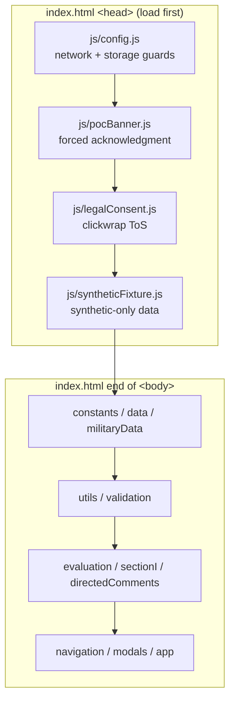
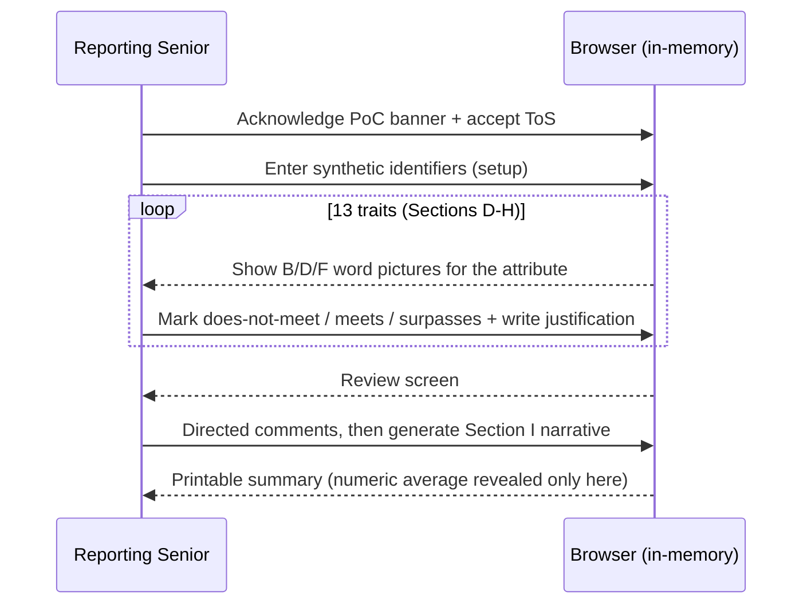

# Architecture Overview

This is a **static, client-only** proof-of-concept. There is no backend, no
database, no authentication, and no persistence. One Reporting Senior drafts one
FITREP per browser session; everything lives in memory and is gone on reload.

Any prior documentation describing an Express backend, login flow, GitHub
storage, `localStorage`/`IndexedDB`, or a "unified storage" layer is obsolete —
that code was deleted. The runtime guards in `js/config.js` actively block
`fetch` and `Storage.setItem`, so the charter (`PoC-CHARTER.md`) is enforced in
code, not just on paper.

## How it loads

`index.html` loads ~25 plain `<script>` tags in a fixed order — no bundler, no
ES modules, no build step. Load order is a live dependency. The charter guards
and consent/banner scripts load first in `<head>`; the methodology engine
modules load at the end of `<body>`.

## State

All evaluation state is IIFE-scoped inside `js/evaluation.js`
(`evaluationResults`, `currentTraitIndex`, etc.) and exposed read-only through
`EvaluationAPI.state`. A few mutable objects (`evaluationResults`,
`evaluationMeta`, `allTraits`) are shared across modules via `window`. There is
no save: a `beforeunload` guard warns the user that refreshing discards the
draft.

## Flow

## What is intentionally absent

Sections A-C, the Reviewing Officer (Section J), MRO acknowledgment (Section K),
RS profile / relative value, and any HQMC submission path are out of scope by
design — see `PoC-CHARTER.md`.
